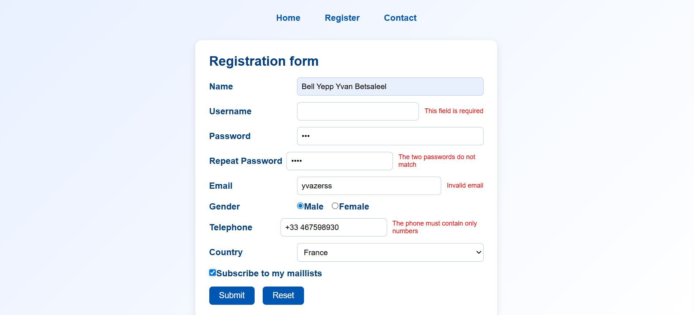

# AI LOGISTICS – Registration Form

A clean and professional registration form built with **HTML**, **CSS**, and **JavaScript**, featuring custom client-side validation.  
This project is part of my web development coursework and serves as a demonstration of my front-end skills.

---

##  Project Overview

This project simulates a registration form for a fictional company: **AI LOGISTICS / IMAGINARY COMPANY**.

It includes:

- First Name
- Last Name
- Username
- Password + Repeat Password (with match validation)
- Email (regex validation)
- Gender (radio buttons)
- Telephone (numeric validation)
- Country (select dropdown)
- Newsletter subscription (checkbox)

The goal is to validate user input on the client side and provide a clean, modern UI.

---

##  Technologies Used

- **HTML5** – semantic structure  
- **CSS3** – responsive and modern styling  
- **JavaScript (Vanilla)** – form validation logic  

No frameworks, no libraries — pure front-end fundamentals.

---

## Features

###  Form Validation
- Required fields detection  
- Email format validation  
- Password confirmation check  
- Telephone number validation (digits only, optional `+`)  
- Real-time error clearing when the user corrects input  

###  User Interface
- Modern, professional design  
- Responsive layout  
- Styled navigation bar  
- Clean form container with shadow and rounded corners  


###  UX Behavior
- `blur` event → validates when leaving a field  
- `input` event → removes error messages dynamically  
- Error messages displayed next to each field  

---

##  Project Structure

```text

├── index.html      # Main page with the registration form
├── style.css       # Modern and responsive styling
└── script.js       # Custom JavaScript validation logic

```
## Screenshot




## Author
Yvan Betsaleel Bell Yepp  
Web development & systems engineering student
Currently pivoting toward Data / AI / Software Development
Looking for a web development internship.


## Contact
**EMAIL**: yvan2220@gmail.com
